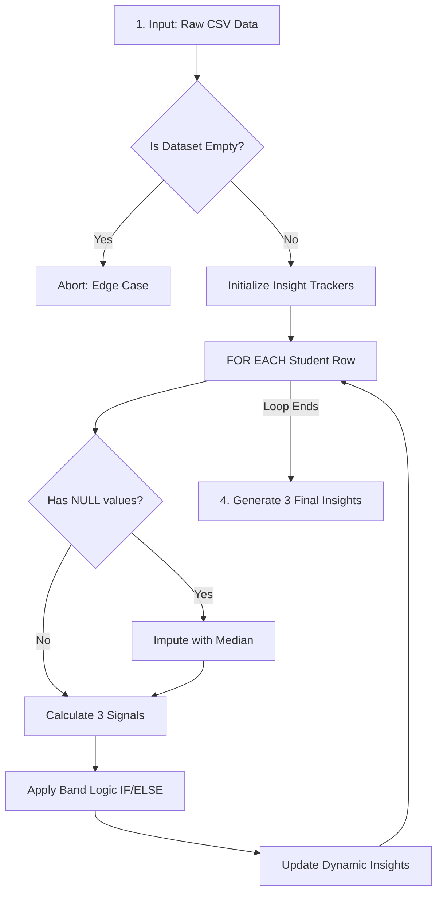

# Q2. Data Analytics Pipeline Algorithm

### 1. System Architecture Flowchart


<br>

### 2. Pipeline Pseudocode

```text
ALGORITHM StudentAnalyticsPipeline
INPUT: tabular_data (CSV format)
OUTPUT: Processed dataset with Bands, 3 Final Insights

BEGIN
    // 1. Edge Case Handling
    IF tabular_data is EMPTY THEN
        PRINT "Error: Dataset is empty. Pipeline aborted."
        RETURN
    END IF

    // Initialize metric trackers for insights
    top_score = 0
    top_student = NULL
    support_list = []
    dept_totals = {}
    dept_counts = {}

    // 2. Loop Structure
    FOR EACH student_row IN tabular_data DO
        
        // Validation: Handle missing values
        IF student_row has NULL values THEN
            student_row = IMPUTE missing values with column median
        END IF

        // Calculate Signals (Assuming weightage out of 100)
        att_signal = (student_row.attendance_pct / 100) * 20
        task_signal = (student_row.tasks_completed / 10) * 30
        lab_assgn_signal = ((student_row.assignment_score + student_row.lab_score) / 200) * 50
        
        final_score = att_signal + task_signal + lab_assgn_signal

        // 3. Decision Conditions (Classification)
        IF final_score < 40 THEN
            student_row.band = "Support"
            APPEND student_row.name TO support_list
        ELSE IF final_score < 70 THEN
            student_row.band = "Developing"
        ELSE IF final_score < 90 THEN
            student_row.band = "Strong"
        ELSE
            student_row.band = "Excellent"
        END IF

        // Track data for Output Insights dynamically
        IF final_score > top_score THEN
            top_score = final_score
            top_student = student_row.name
        END IF
        
        ADD final_score TO dept_totals[student_row.department]
        INCREMENT dept_counts[student_row.department]

    END FOR

    // 4. Output Generation
    PRINT "--- Final Analytics Insights ---"
    FOR EACH dept IN dept_totals:
        PRINT "Dept Average [" + dept + "]: " + (dept_totals[dept] / dept_counts[dept])
    PRINT "Top Performer:", top_student, "(", top_score, ")"
    PRINT "Students needing immediate support:", support_list
END
```

### 3. Detailed Algorithmic Explanation

* **Input, Output & Edge Cases:** The algorithm begins by ingesting a raw CSV dataset (`INPUT`). An immediate Edge Case check verifies if the file is completely empty; if true, it aborts the pipeline to prevent downstream fatal errors. The final `OUTPUT` yields the classified students and three calculated insights.
* **Loop Structure & Validation:** A linear `FOR EACH` loop iterates through the data row-by-row. Inside this loop, a critical Validation step checks for missing (`NULL`) values, imputing them via the mathematical median to ensure signal calculations remain robust.
* **Decision Conditions:** Following the signal calculations, a chained `IF / ELSE IF / ELSE` block acts as a mathematical boundary gate. It classifies each student into one of four distinct performance bands based on their aggregated `final_score`.
* **Output Processing:** The algorithm efficiently tracks the "Top Performer," the "Support List," and "Department Totals" dynamically during the main loop. Once execution breaks out of the loop, it prints these final aggregated insights.